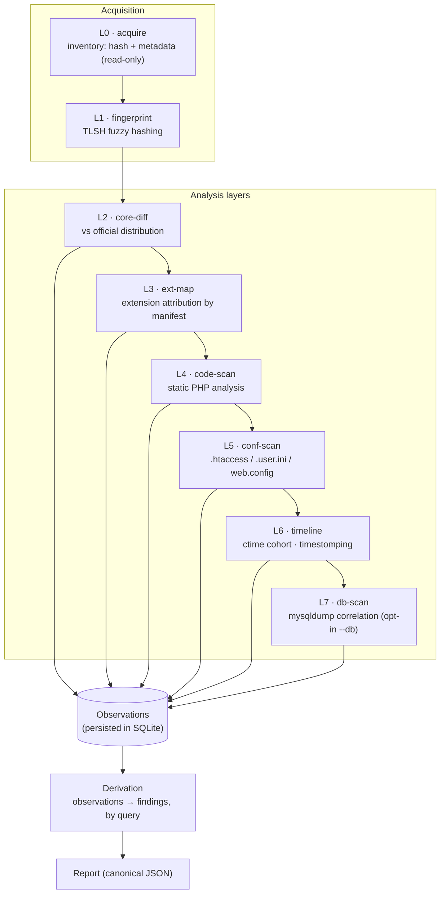
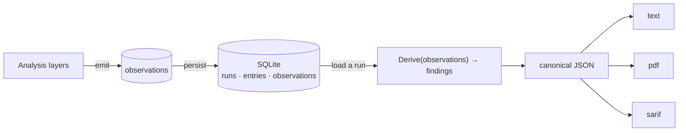
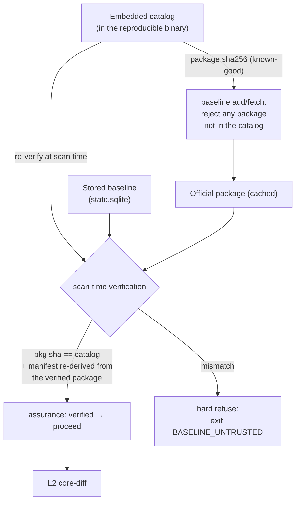
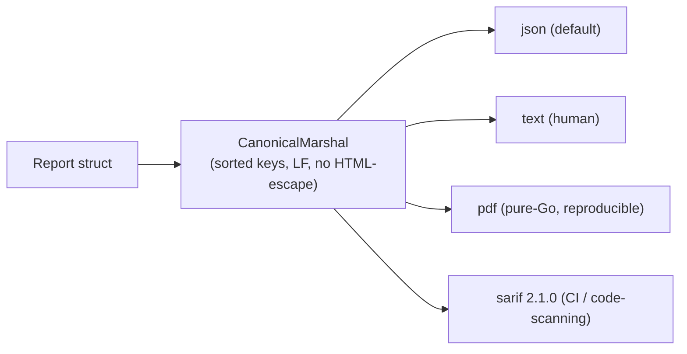

# J0Witness — Architecture

> **En español:** [ARQUITECTURA.md](ARQUITECTURA.md)

This document describes how J0Witness is built: its design principles, the analysis
pipeline, the event model, the trust model, and how the pieces map to the source
tree. Diagrams are written in [Mermaid](https://mermaid.js.org/) and render on
GitHub and most Markdown viewers.

---

## 1. Design principles

A small set of binding principles shapes every part of the system. They are worth
stating up front because most of the architecture is a direct consequence of them.

1. **Evidence is immutable.** The analyzed tree is read-only; J0Witness never
   writes to it and never executes it.
2. **Event-centric.** The system records *observations* (facts) and *derives*
   verdicts (findings) from them by query. Findings are never stored as primary
   truth — they are re-derived on demand.
3. **Determinism.** No map-iteration reaches serialized output; collections are
   sorted before emit; the wall clock is passed in, never read ad hoc. The same
   inputs produce byte-identical output.
4. **A false positive is a severe defect.** When a benign explanation is
   conclusive, a finding is degraded — never elevated on a weak signal.
5. **Offline by default.** A single enumerated network path exists (authorized
   baseline fetch); everything else is local.
6. **Never execute the tree; be safe against hostile input.** XML parsing is
   XXE-safe; no runtime dependencies; the SQL dump is parsed, never run.
7. **Canonical JSON first.** One canonical serialization is the source of truth;
   `text`, `pdf`, and `sarif` are pure, deterministic projections of it.
8. **Corpus-first.** Every detector ships with positive and negative corpus cases.
9. **A single declared root of trust.** The embedded catalog (baked into the
   reproducible binary) is the only trusted input; everything cached or stored is
   re-verified against it.

## 2. The analysis pipeline (L0–L7)

Each layer reads the evidence captured by earlier layers and emits observations. No
layer decides a verdict; that happens later, by query.



Baseline for L2/L3 comes from the **embedded catalog** plus the official
distribution package the operator ingested (`baseline add`/`fetch`), verified at
scan time (§4).

## 3. The event model — observations vs findings

This is the load-bearing idea. Layers do **not** write findings; they write
observations — `(subject, type, evidence, source, confidence, observed_at)`. A
finding is a *derived* verdict computed from observations by a pure function.



Consequences:

- **Re-render for free.** `report` reloads a persisted run and re-derives findings
  without touching the tree. `diff` re-derives two runs and compares them.
- **Stable finding IDs.** A finding's ID is `sha256(rule ∥ subject ∥ evidence)` with
  no run or timestamp — so two identical scans produce identical IDs, which is what
  makes scan-to-scan drift and CI gating meaningful.
- **Corroboration never becomes load-bearing.** Low-confidence signals (e.g. a
  ctime outlier) annotate an existing finding but can never create one or raise its
  severity (Principle 4).

## 4. Trust model — the embedded catalog as root

The forensic value of every core comparison depends on the baseline being genuine.
J0Witness makes the embedded catalog the single verified root of trust and
re-verifies everything derived from it before the diff relies on it.



If the cached package is absent, the manifest is checked for self-consistency and
the scan proceeds with `assurance: partial`, honestly declared in the report.

## 5. Determinism and reproducibility

Two distinct guarantees, both forensic:

- **Output determinism.** Given the same tree, baseline, binary, and flags, the
  canonical JSON (and every projection derived from it) is byte-identical. Achieved
  by sorting before emit, passing the clock in, and never iterating maps into
  output.
- **Build reproducibility.** `CGO_ENABLED=0 -trimpath -buildid=` yields the same
  binary hash from the same source — verified by a double-build gate. A report is
  only as trustworthy as the tool that produced it.

## 6. Output projections



All four are pure projections of the same canonical bytes. Report prose flows
through an i18n catalog (`en`/`es`); enums (severity, confidence, threat model)
stay raw in both languages so machine consumers are language-independent.

## 7. Source map

```
src/
├── cmd/j0witness/        entry point (thin main → internal/cli)
├── internal/
│   ├── cli/              command tree: scan, report, diff, runs, baseline, extension, inventory
│   ├── acquire/          L0 — inventory, hashing, metadata (read-only)
│   ├── fingerprint/      L1 — TLSH fuzzy hashing
│   ├── corediff/         L2 — diff vs official distribution
│   ├── extmap/           L3 — extension discovery & attribution
│   ├── codescan/         L4 — static PHP analysis
│   ├── confscan/         L5 — server-config directive analysis
│   ├── timeline/         L6 — temporal corroboration (ctime cohort)
│   ├── dbscan/           L7 — mysqldump parsing & DB correlation
│   ├── drift/            scan-to-scan comparison engine
│   ├── baseline/         catalog, package ingest, scan-time verification
│   ├── observe/          the Observation type (the event substrate)
│   ├── finding/          Derive(): observations → findings; suppression
│   ├── report/           canonical JSON + text/pdf/sarif renderers
│   ├── i18n/             bilingual message catalog
│   ├── inventory/        SQLite persistence (runs/entries/observations)
│   ├── provenance/       threat model, timestamp anomaly, version
│   ├── layout/           admin/api dir remapping (hardened installs)
│   ├── manifest/         extension manifest parsing & install layout
│   └── safefs/           read-only, symlink-safe filesystem access
├── data/catalog/         embedded known-good catalog
├── tools/                maintenance tooling (corpus generation, etc.)
└── testdata/corpus/      positive + negative corpus per detector
```

## 8. Where to read next

- **[BUILD.md](BUILD.md)** — compile the binary and run the reproducibility gate.
- **[ROADMAP.md](ROADMAP.md)** — planned and possible future layers.
- The source under [`src/internal/`](../src/internal/) — each package has a doc
  comment stating its layer and responsibility.
