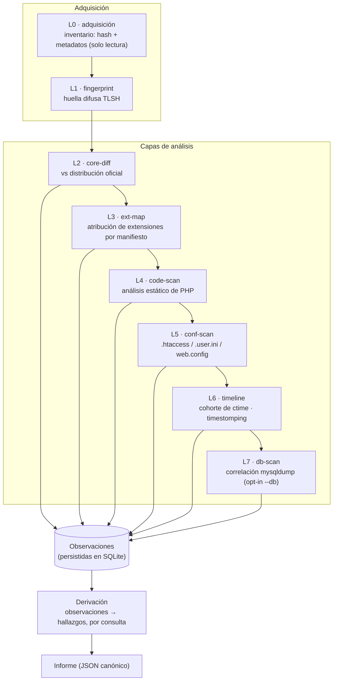
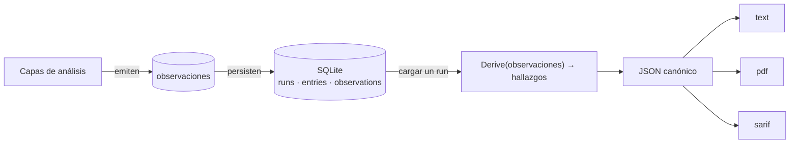
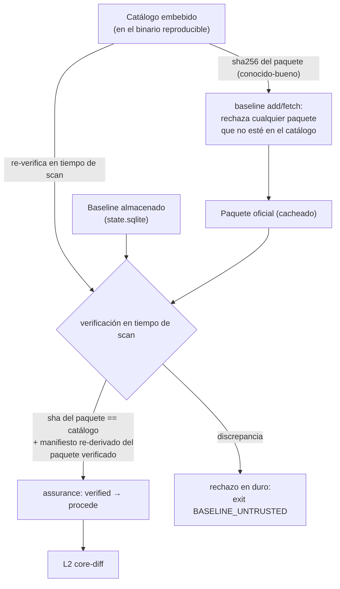
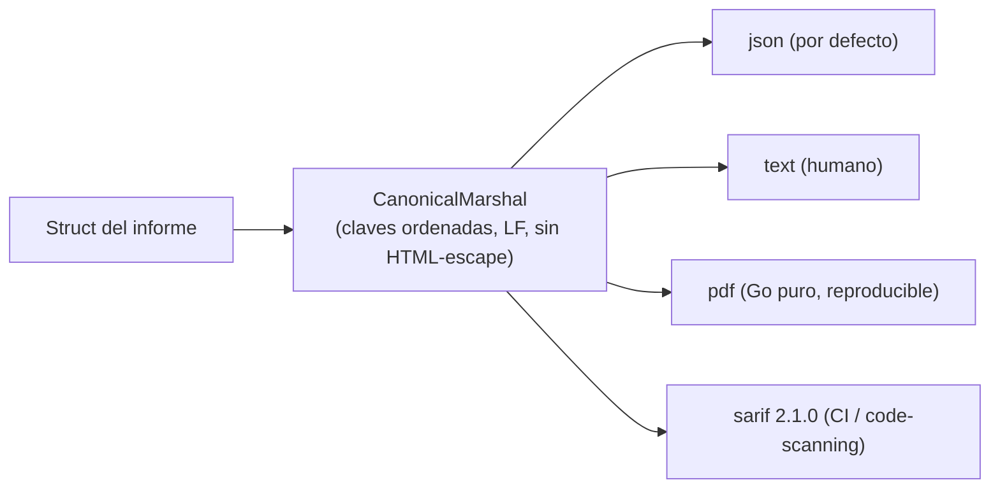

# J0Witness — Arquitectura

> **In English:** [ARCHITECTURE.md](ARCHITECTURE.md)

Este documento describe cómo está construido J0Witness: sus principios de diseño,
el pipeline de análisis, el modelo de eventos, el modelo de confianza, y cómo las
piezas se mapean al árbol de fuentes. Los diagramas están en
[Mermaid](https://mermaid.js.org/) y se renderizan en GitHub y en la mayoría de
visores de Markdown.

---

## 1. Principios de diseño

Un pequeño conjunto de principios vinculantes moldea cada parte del sistema. Vale
la pena declararlos por adelantado porque casi toda la arquitectura es consecuencia
directa de ellos.

1. **La evidencia es inmutable.** El árbol analizado es solo-lectura; J0Witness
   jamás escribe en él ni lo ejecuta.
2. **Centrado en eventos.** El sistema registra *observaciones* (hechos) y *deriva*
   veredictos (hallazgos) de ellas por consulta. Los hallazgos nunca se almacenan
   como verdad primaria — se re-derivan bajo demanda.
3. **Determinismo.** Ninguna iteración de map llega a la salida serializada; las
   colecciones se ordenan antes de emitir; el reloj se pasa como parámetro, nunca
   se consulta ad hoc. Las mismas entradas producen salida byte-idéntica.
4. **Un falso positivo es un defecto severo.** Cuando una explicación benigna es
   concluyente, un hallazgo se degrada — nunca se eleva sobre una señal débil.
5. **Offline por defecto.** Existe un único camino de red enumerado (descarga
   autorizada del baseline); todo lo demás es local.
6. **Jamás ejecutar el árbol; ser seguro ante entrada hostil.** El parseo de XML es
   resistente a XXE; sin dependencias de runtime; el volcado SQL se parsea, jamás
   se ejecuta.
7. **JSON canónico primero.** Una única serialización canónica es la fuente de
   verdad; `text`, `pdf` y `sarif` son proyecciones puras y deterministas de ella.
8. **Corpus primero.** Cada detector nace con sus casos de corpus positivo y
   negativo.
9. **Una única raíz de confianza declarada.** El catálogo embebido (horneado en el
   binario reproducible) es la única entrada confiable; todo lo cacheado o
   almacenado se re-verifica contra él.

## 2. El pipeline de análisis (L0–L7)

Cada capa lee la evidencia capturada por capas anteriores y emite observaciones.
Ninguna capa decide un veredicto; eso ocurre después, por consulta.



El baseline para L2/L3 viene del **catálogo embebido** más el paquete de la
distribución oficial que el operador incorporó (`baseline add`/`fetch`), verificado
en tiempo de scan (§4).

## 3. El modelo de eventos — observaciones vs hallazgos

Esta es la idea portante. Las capas **no** escriben hallazgos; escriben
observaciones — `(sujeto, tipo, evidencia, fuente, confianza, momento_observado)`.
Un hallazgo es un veredicto *derivado*, computado de las observaciones por una
función pura.



Consecuencias:

- **Re-render gratis.** `report` recarga un run persistido y re-deriva los hallazgos
  sin tocar el árbol. `diff` re-deriva dos runs y los compara.
- **IDs de hallazgo estables.** El ID de un hallazgo es `sha256(regla ∥ sujeto ∥
  evidencia)` sin run ni timestamp — así dos escaneos idénticos producen IDs
  idénticos, que es lo que hace significativos la deriva scan-a-scan y el gate de
  CI.
- **La corroboración nunca se vuelve portante.** Las señales de baja confianza
  (p.ej. un outlier de ctime) anotan un hallazgo existente pero jamás crean uno ni
  elevan su severidad (Principio 4).

## 4. Modelo de confianza — el catálogo embebido como raíz

El valor forense de toda comparación de core depende de que el baseline sea
genuino. J0Witness hace del catálogo embebido la única raíz de confianza
verificada y re-verifica todo lo derivado de él antes de que el diff confíe.



Si el paquete cacheado está ausente, el manifiesto se comprueba por
auto-consistencia y el scan procede con `assurance: partial`, declarado
honestamente en el informe.

## 5. Determinismo y reproducibilidad

Dos garantías distintas, ambas forenses:

- **Determinismo de salida.** Dado el mismo árbol, baseline, binario y flags, el
  JSON canónico (y toda proyección derivada de él) es byte-idéntico. Se logra
  ordenando antes de emitir, pasando el reloj como parámetro y jamás iterando maps
  hacia la salida.
- **Reproducibilidad del build.** `CGO_ENABLED=0 -trimpath -buildid=` produce el
  mismo hash de binario desde la misma fuente — verificado por un gate de
  doble-build. Un informe solo es tan confiable como la herramienta que lo produjo.

## 6. Proyecciones de salida



Las cuatro son proyecciones puras de los mismos bytes canónicos. La prosa del
informe fluye por un catálogo i18n (`es`/`en`); los enums (severidad, confianza,
modelo de amenaza) quedan crudos en ambos idiomas para que los consumidores
máquina sean independientes del idioma.

## 7. Mapa de fuentes

```
src/
├── cmd/j0witness/        punto de entrada (main fino → internal/cli)
├── internal/
│   ├── cli/              árbol de comandos: scan, report, diff, runs, baseline, extension, inventory
│   ├── acquire/          L0 — inventario, hashing, metadatos (solo lectura)
│   ├── fingerprint/      L1 — huella difusa TLSH
│   ├── corediff/         L2 — diff vs distribución oficial
│   ├── extmap/           L3 — descubrimiento y atribución de extensiones
│   ├── codescan/         L4 — análisis estático de PHP
│   ├── confscan/         L5 — análisis de directivas de config del servidor
│   ├── timeline/         L6 — corroboración temporal (cohorte de ctime)
│   ├── dbscan/           L7 — parseo de mysqldump y correlación con BD
│   ├── drift/            motor de comparación scan-a-scan
│   ├── baseline/         catálogo, ingesta de paquete, verificación en tiempo de scan
│   ├── observe/          el tipo Observation (el substrato de eventos)
│   ├── finding/          Derive(): observaciones → hallazgos; supresión
│   ├── report/           JSON canónico + renderizadores text/pdf/sarif
│   ├── i18n/             catálogo de mensajes bilingüe
│   ├── inventory/        persistencia SQLite (runs/entries/observations)
│   ├── provenance/       modelo de amenaza, anomalía de timestamp, versión
│   ├── layout/           remapeo de dir admin/api (instalaciones endurecidas)
│   ├── manifest/         parseo de manifiestos de extensión y layout de instalación
│   └── safefs/           acceso solo-lectura, seguro ante symlinks
├── data/catalog/         catálogo conocido-bueno embebido
├── tools/                herramientas de mantenimiento (generación de corpus, etc.)
└── testdata/corpus/      corpus positivo + negativo por detector
```

## 8. Dónde seguir leyendo

- **[BUILD.md](BUILD.md)** — compilar el binario y correr el gate de reproducibilidad.
- **[ROADMAP.md](ROADMAP.md)** — capas futuras planificadas y posibles.
- La fuente bajo [`src/internal/`](../src/internal/) — cada paquete tiene un
  comentario de doc que declara su capa y responsabilidad.
